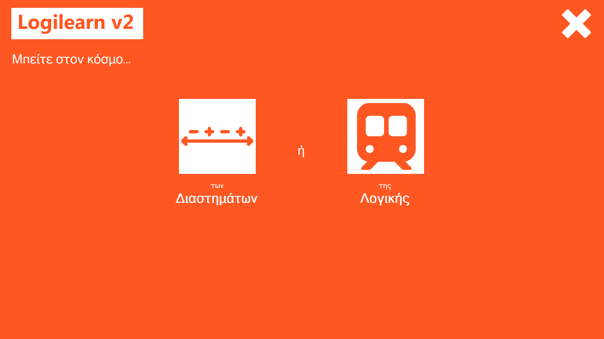
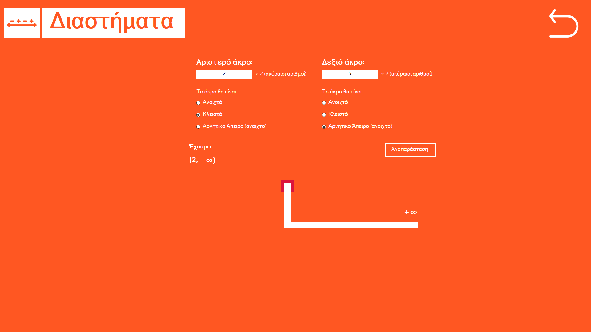
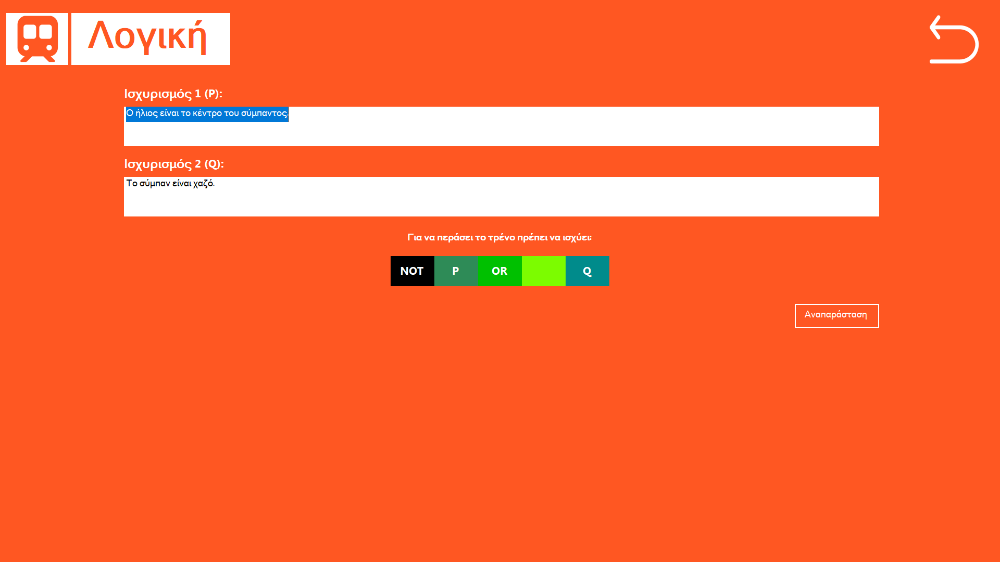

# LogilearnV2
Η εξέλιξη της παλιάς μας εργασίας Logilearn. Ένα εργαλείο εκμάθησης βασικών μαθηματικών εννοιών σε παιδιά με μαθησιακές δυσκολίες. Η παλιά εργασία μπορεί να βρεθεί σε αυτόν τον σύνδεσμο: https://github.com/NanoTrojans/logilearn-arduino.

# Το πρόγραμμα Logilearn v2

## Home Page

## Διαστήματα

## Λογική

